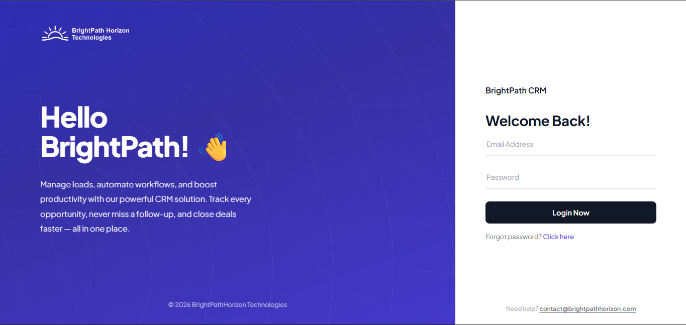
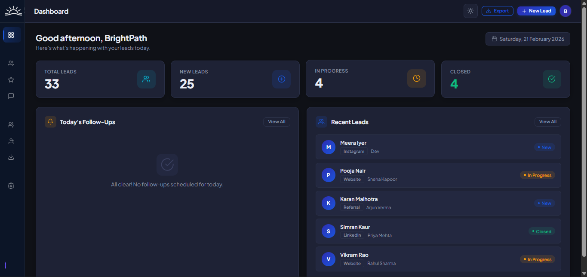
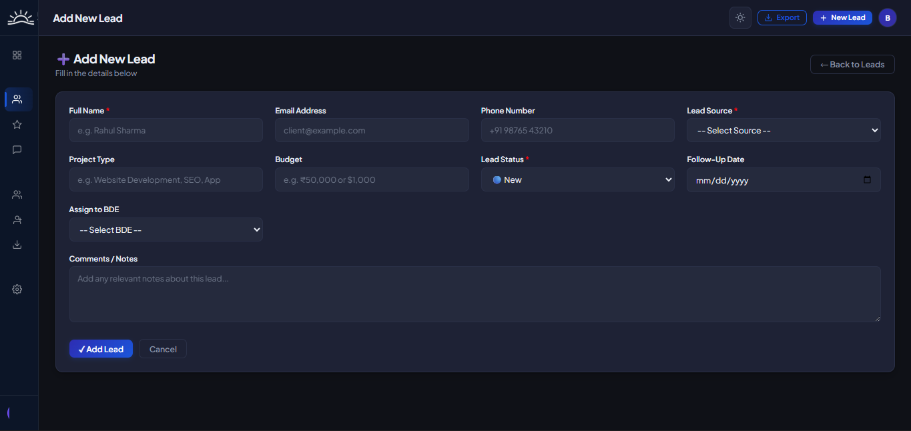
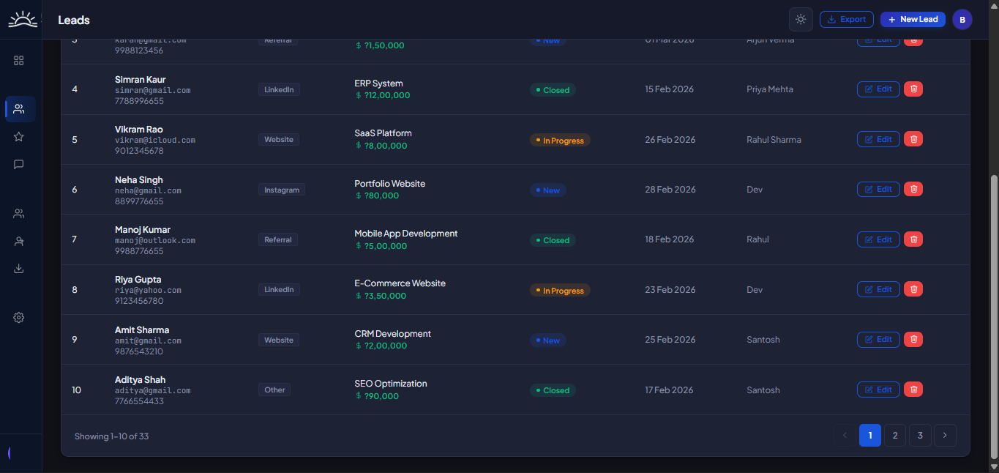
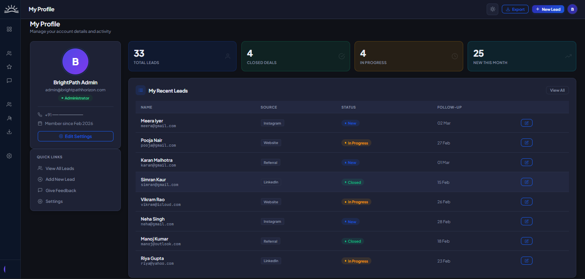
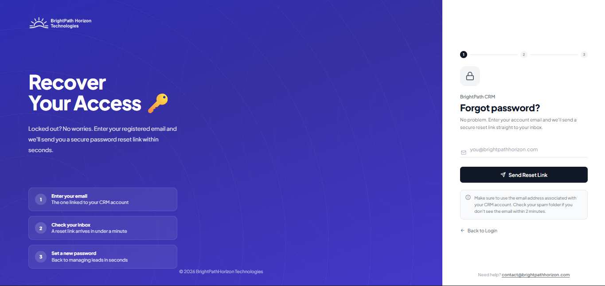
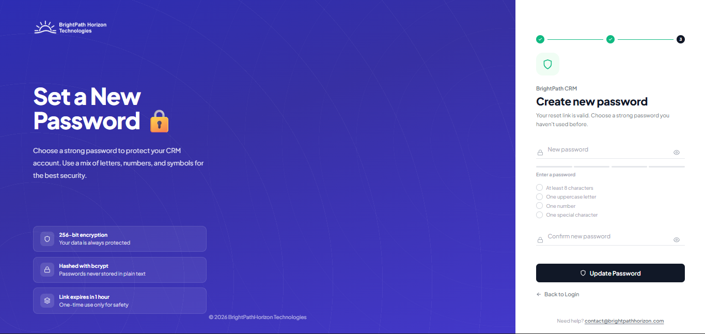

# 🚀 BrightPathHorizon CRM

> Modern Lead & Sales Management Platform
> Built with Node.js • Express • MySQL
> Designed with a SaaS-first architecture

---

## 🏷️ Tech Stack Badges


---

# 🌟 About The Project

BrightPathHorizon CRM is a full-stack SaaS-style Customer Relationship Management system designed to streamline lead tracking, performance monitoring, and administrative workflows.

It demonstrates:

* Secure authentication architecture
* Modular backend design
* Role-based access control
* Production-ready configuration
* Enterprise UI design

---

# ✨ SaaS Feature Grid

| 🚀 Feature                   | 💡 Description                                        |
| ---------------------------- | ----------------------------------------------------- |
| 🔐 Secure Authentication     | Session-based login with bcrypt password hashing      |
| 👥 Role-Based Access         | Admin & BDE access control                            |
| 📈 Lead Lifecycle Management | Create, update, assign, and track leads               |
| 📊 Real-Time Dashboard       | Overview of total, new, in-progress, and closed deals |
| 📅 Follow-Up Scheduling      | Date-based reminders for lead follow-ups              |
| 💰 Incentive Tracking        | Monthly performance-based incentives                  |
| 📝 Feedback System           | Internal structured feedback collection               |
| 📤 Excel Export              | Export leads to spreadsheet format                    |
| 🌙 Dark SaaS UI              | Modern productivity-focused interface                 |
| ⚙️ Modular Architecture      | Clean Express routing & middleware                    |

---

# 🖥️ Product Preview

---

## 🔐 Login Page



Secure authentication with password recovery support.

---

## 📊 Dashboard Overview



Track:

* Total Leads
* New Leads
* In Progress
* Closed Deals
* Follow-Ups
* Recent Activity

---

## ➕ Add New Lead



Comprehensive form including:

* Lead Source
* Budget
* Project Type
* Status
* Follow-Up Date
* BDE Assignment

---

## 📋 Leads Management



Includes:

* Status badges
* Budget highlights
* Edit & Delete actions
* Pagination

---

## 👤 Profile & Performance



Personal analytics dashboard for users.

---

## 🔐 Password Recovery Flow

### Forgot Password



### Reset Password



---

# 🏗️ Architecture Overview

Client
⬇
Express Router
⬇
Middleware (Auth / Role Validation)
⬇
Controller Logic
⬇
MySQL Database
⬇
EJS Rendering

---

# ⚙️ Installation Guide

### 1️⃣ Clone Repository

```bash
git clone https://github.com/shard12/brightpathhorizon-crm.git
cd brightpathhorizon-crm
```

---

### 2️⃣ Install Dependencies

```bash
npm install
```

---

### 3️⃣ Configure Environment Variables

Create `.env` file:

```
PORT=3000
DB_HOST=localhost
DB_USER=root
DB_PASSWORD=your_password
DB_NAME=brightpathhorizon
SESSION_SECRET=your_secure_key
```

---

### 4️⃣ Setup Database

```
mysql -u root -p < backup.sql
```

---

### 5️⃣ Run Application

```
npm run dev
```

Visit:

```
http://localhost:3000
```

---

# 🚀 Deployment Guide

## 🌍 Deploy on Render (Recommended)

1. Connect GitHub repository to Render
2. Set Build Command:

   ```
   npm install
   ```
3. Set Start Command:

   ```
   node server.js
   ```
4. Add environment variables in Render dashboard

---

## 🚆 Deploy on Railway

* Deploy from GitHub
* Add MySQL plugin
* Configure environment variables
* Automatic build & deployment

---

## ☁️ Deploy on AWS EC2

* Launch Ubuntu instance
* Install Node & MySQL
* Use PM2:

  ```
  pm2 start server.js
  ```
* Configure Nginx reverse proxy

---

# 🛡️ Security Highlights

* bcrypt password hashing
* Express session protection
* Role-based middleware
* Environment variable isolation
* Helmet HTTP headers

---

# 📈 Future Roadmap

* Real-time notifications
* Advanced analytics dashboard
* REST API version
* Multi-tenant SaaS support
* Activity logs
* Cloud-native deployment

---

# 👨‍💻 Author

Sharad
Full Stack Developer
Computer Science Student

---

# 📄 License

Developed for educational and portfolio demonstration purposes.
